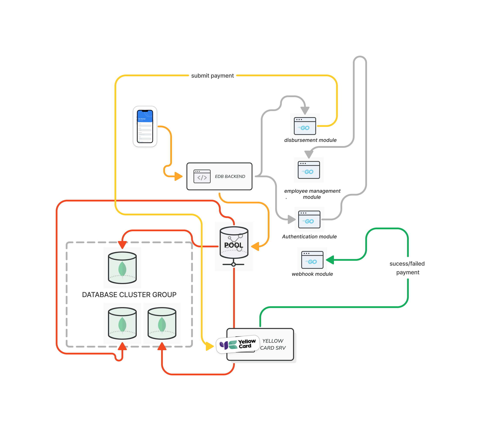

# Cudium

<figure><figcaption>
<strong>Cudium</strong> 
</figcaption></figure>

### **Backend Engineer | Node.js, Sails.js, JavaScript**   &#x20;

Sep 2022 - Present · 1 yr 11 mos  Ife, Osun State, Nigeria ·                                          &#x20;

***

**Financial Technology & Backend Development:**

* Implemented a real-time transaction resolution system using MongoDB triggers, processing over $650K with \~50K transaction capacity
* Designed and implemented a ledger system for accurate financial transaction records
* Integrated core backend with event tracking third-party application, increasing user engagement insights by 85%
* Developed webhooks for event notifications using Sails JS and Firebase messaging service

**Security & Performance Optimization:**

* Spearheaded new security feature development, increasing overall application security by 55%
* Managed backend team to further enhance application security by an additional 25%
* Reduced cache deployment cost by 20%
* Implemented robust error handling, data validation, and query optimization techniques

**Infrastructure & DevOps:**

* Crafted load balancing and proxying strategy using Nginx and Docker, optimizing environment access to 100%
* Integrated extensible emailing service for customer notifications

**Documentation & UI/UX:**

* Created comprehensive API documentation for backend and frontend teams
* Revamped email UI, improving user experience by 70%

**Leadership & Collaboration:**

* Led development team of 2 frontend engineers, and 1 backend engineer, collaborating closely with CTO
* Managed backend engineers in feature development and security enhancements
