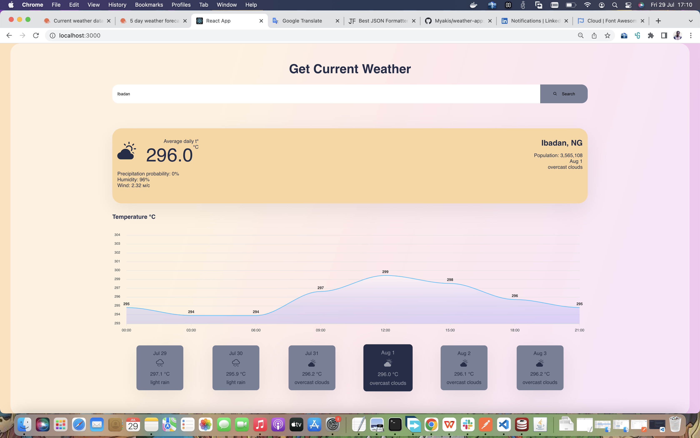

# GRPC Weather App

### Overview

The Weather App is a web application designed to provide users with current weather conditions and forecasts for any location worldwide. This project showcases the use of modern web technologies, including Node.js, React.js, gRPC, and Docker.

### Technologies Used

* **Node.js**: Backend service for retrieving weather data.
* **React.js**: Frontend user interface.
* **gRPC**: Communication between frontend and backend services.
* **Docker**: Containerization of the application for easy deployment.

### Features

* **gRPC Integration**: Efficient data communication between the front end and back end.
* **Autocomplete Suggestion**: Helps users quickly find and select locations.

### Project Structure

The project directory is organized as follows:

* **app/backend**: Contains the backend service for retrieving weather data.
* **app/frontend**: Contains the frontend user interface for interacting with the backend data.

### Running the Project

#### With Docker

1. Clone the repository.
2. Navigate to the project directory.
3. Build the Docker images: `docker-compose build`
4. Start the services: `docker-compose up`
5. Open your browser and go to `http://localhost:3000` to view the Weather App website.

#### Without Docker

1. Clone the repository.
2. Navigate to the base directory and run the backend service: `npm install && npm start`
3. Navigate to the frontend directory and run the frontend service:&#x20;

```bash
cd app/frontend
npm install && npm run grpc::server

```

4. Open your browser and go to `http://localhost:3000` to view the Weather App website.

### Frontend&#x20;

<figure><figcaption></figcaption></figure>

### Conclusion

This project demonstrates my ability to integrate multiple technologies to build a functional and user-friendly web application. The Weather App serves as a solid foundation for future enhancements and showcases my problem-solving skills and technical expertise.
